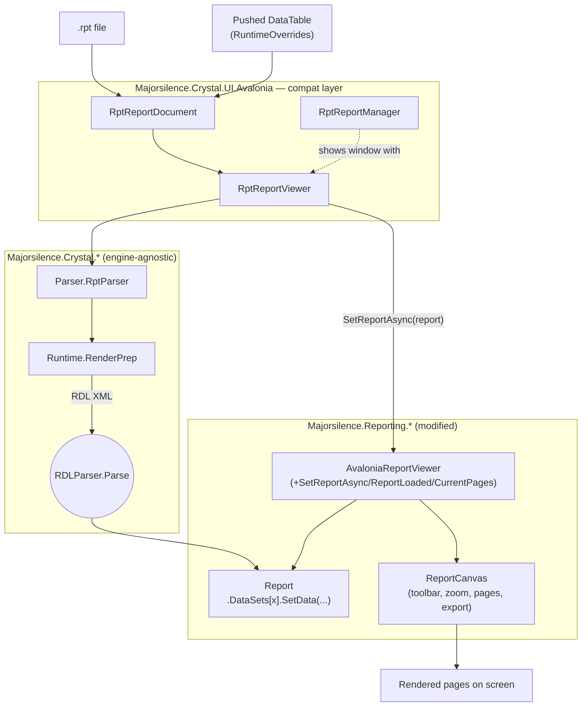

# Majorsilence.Crystal

A .NET library for reading Crystal Reports `.rpt` files and converting them to
SSRS RDL without requiring the SAP Crystal Reports runtime or SDK.

## Overview

Crystal Reports `.rpt` files use a proprietary binary format (OLE Compound
Document containing a TSLV stream). This library reverse-engineers that format
to extract report structure, fields, formulas, groups, and layout, then
generates SSRS 2005 RDL XML that can be loaded by SQL Server Reporting Services
or MajorSilence Reporting.

## Projects

| Project | Purpose |
|---|---|
| `Majorsilence.Crystal.Model` | Neutral AST — `ReportDefinition`, sections, fields, objects |
| `Majorsilence.Crystal.Parser` | OLE reader, TSLV parser, AES-CFB128 decryptor, zlib inflate |
| `Majorsilence.Crystal.Converter` | RDL emitter and Crystal formula transpiler (Irony grammar) |

## Report Viewer / Compat Layer

`Majorsilence.Crystal.UI.Avalonia` provides an interactive viewer with a
Crystal-Reports-like API (report document in, `ReportLoaded` event out),
backed by push-model in-memory data and rendered via a locally modified
`Majorsilence.Reporting.UI.RdlAvalonia`:



## Requirements

- .NET 10 SDK

## Build

```
dotnet build
```

## Usage

```csharp
using Majorsilence.Crystal.Parser;
using Majorsilence.Crystal.Converter;

var result = RptParser.Parse("report.rpt");
if (result.Success)
{
    string rdl = new RdlConverter().Convert(result.Report!);
    File.WriteAllText("report.rdl", rdl);
}
```

## Running the Tests

Unit and integration tests require no setup:

```
dotnet test
```

The corpus tests run against 40 real-world `.rpt` files that are not included
in the repository due to licensing. Download them first:

```
bash scripts/download-test-rpts.sh --download-only
dotnet test
```

The corpus files are sourced from the public
[benbrahim777/Crystal-Reports](https://github.com/benbrahim777/Crystal-Reports)
repository. If the corpus directory (`tests/rpt-corpus/`) is absent, those
tests are silently skipped — the rest of the test suite (409+ tests) runs
without them.

## What is Converted

- Report sections: ReportHeader, PageHeader, GroupHeader, Details,
  GroupFooter, PageFooter, ReportFooter
- Database fields, formula fields, running total fields, special fields
  (Page Number, Print Date, Report Title, etc.)
- Groups with sort direction, group header text, and group footer aggregates
- Record selection formula converted to SSRS dataset filters
- TextObject content with inline field references resolved
- FieldObject bounds, fonts (name, size, bold, italic, underline), foreground
  color, and text alignment
- Crystal formula syntax transpiled to SSRS VB.NET expressions via an
  Irony-based grammar, with a regex fallback for unrecognised constructs
- Crystal color constants (`crRed`, `crBlack`, etc.) mapped to CSS color
  strings for use in SSRS style expressions

## Known Limitations

- **Connection strings**: The `QESession` OLE stream is encrypted with a
  proprietary key and cannot be decoded. The generated RDL contains an empty
  `<ConnectString/>` that must be filled in manually.
- **Crystal summary fields** (group-level aggregates defined via the Crystal
  UI): Not parsed from the binary. Numeric columns in group footers get a
  `=Sum()` expression by heuristic; non-numeric columns are left empty.
- **Cross-tab and OLAP grid objects**: Not supported. Reports that consist
  primarily of cross-tab objects will produce an RDL with an empty body.
- **Crystal variable declarations** (`Local NumberVar`, `Local StringVar`,
  etc.) in formula fields: Cannot be translated to SSRS VB.NET and are
  emitted as `=""`.

## License

Tri-licensed under your choice of MIT, Apache 2.0, or BSD 3-Clause.
See [LICENSE](LICENSE) for the full text of all three licenses.
