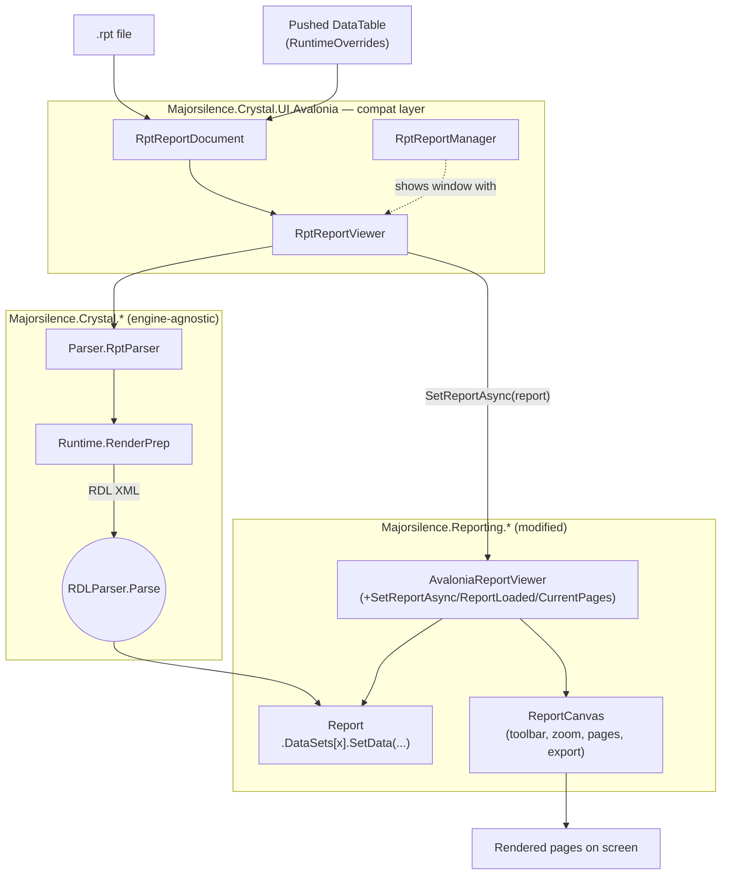

# Majorsilence.Crystal

A .NET library for reading Crystal Reports `.rpt` files and converting them to
SSRS RDL without requiring the SAP Crystal Reports runtime or SDK.

## Overview

Crystal Reports `.rpt` files use a proprietary binary format (OLE Compound
Document containing a TSLV stream). This library reverse-engineers that format
to extract report structure, fields, formulas, groups, and layout, then
generates SSRS 2005 RDL XML that can be loaded by SQL Server Reporting Services
or MajorSilence Reporting.

## Projects

| Project | Purpose |
|---|---|
| `Majorsilence.Crystal.Model` | Neutral AST — `ReportDefinition`, sections, fields, objects |
| `Majorsilence.Crystal.Parser` | OLE reader, TSLV parser, AES-CFB128 decryptor, zlib inflate |
| `Majorsilence.Crystal.Converter` | RDL emitter and Crystal formula transpiler (Irony grammar) |
| `Majorsilence.Crystal.Runtime` | Runtime overrides (data, parameters, formulas, object suppress/resize/move), applied to the parsed model before conversion; engine-agnostic |
| `Majorsilence.Crystal.RptEngine` | Renders an `.rpt` with pushed data to PDF, CSV, Excel or RTF on the Majorsilence.Reporting engine, with no database access |
| `Majorsilence.Crystal.Cli` | `dotnet tool` for converting files and verifying a corpus |
| `Majorsilence.Crystal.UI.Avalonia` | Interactive viewer with a Crystal-Reports-like API (not packaged) |

## Packages

Each project above except the viewer ships as a NuGet package of the same name. A tag
`vX.Y.Z` builds and tests them at version `X.Y.Z` and drafts a GitHub release holding them;
publishing that release pushes them to nuget.org (`publish-nuget.yml`, Trusted Publishing,
no stored key). Which to reference:

- **To render an `.rpt` with your own data**, reference `Majorsilence.Crystal.RptEngine`; it
  brings the others and the cross-platform (SkiaSharp) build of the engine with it.
- **To convert an `.rpt` to RDL** for another engine or for editing, reference
  `Majorsilence.Crystal.Converter` (which brings `Parser` and `Model`).
- **To read the structure only** (fields, parameters, subreports, object positions),
  `Majorsilence.Crystal.Parser`.

```csharp
using System.Data;
using Majorsilence.Crystal.RptEngine;
using Majorsilence.Crystal.Runtime;

ReportEngine.Init();   // once per process

var data = new DataTable();
data.Columns.Add("Customer Name", typeof(string));   // the report's own column names
data.Rows.Add("Alice");

var overrides = new RuntimeOverrides
{
    Data = data,
    Parameters = { ["Region"] = "West" },   // read by the parameter's declared type
    Suppress = { ["Text3"] = true },        // object names, matched case-insensitively
};

using var rpt = File.OpenRead("report.rpt");
var result = await new ReportEngine().ExportWithWarningsAsync(rpt, overrides, ExportFormat.Pdf);
File.WriteAllBytes($"report.{result.Extension}", result.Bytes);
foreach (var warning in result.Warnings)   // an override that named nothing, never a failure
    Console.WriteLine(warning);
```

The engine never opens the connection a template names: data comes only from
`RuntimeOverrides.Data` and, for a subreport, `RuntimeOverrides.SubreportData` (a table per
subreport name), and a dataset given none renders empty. A report that reads several tables
can instead take one table per Crystal table, by the name the report uses for it, and the
engine joins them with the report's own links:

```csharp
var overrides = new RuntimeOverrides
{
    TableData = { ["Customer"] = customers, ["Orders"] = orders },
};
```

`ReportEngine.Analyze` lists the tables, their columns, and the links it will join them on. Formats are `Pdf`, `Csv`,
`Excel` (`.xlsx`, laid out as the page), `ExcelDataOnly` and `Rtf`. What the engine cannot do
yet is listed under [Known Limitations](#known-limitations); [ROADMAP.md](ROADMAP.md) says
what is planned and [BACKLOG.md](BACKLOG.md) what was measured.

## Report Viewer / Compat Layer

`Majorsilence.Crystal.UI.Avalonia` provides an interactive viewer with a
Crystal-Reports-like API (report document in, `ReportLoaded` event out),
backed by push-model in-memory data and rendered via a locally modified
`Majorsilence.Reporting.UI.RdlAvalonia`:


```mermaid
flowchart TB
    RPT[".rpt file"] & Data["Pushed DataTable\n(RuntimeOverrides)"] --> Doc["RptReportDocument"]

    subgraph UI["Majorsilence.Crystal.UI.Avalonia — compat layer"]
        Doc --> Viewer["RptReportViewer"]
        Manager["RptReportManager"] -.shows window with.-> Viewer
    end

    subgraph Core["Majorsilence.Crystal.* (engine-agnostic)"]
        Viewer --> RptParser["Parser.RptParser"]
        RptParser --> Prep["Runtime.RenderPrep"]
        Prep -->|"RDL XML"| Bridge
    end

    subgraph Reporting["Majorsilence.Reporting.* (modified)"]
        Bridge(("RDLParser.Parse")) --> Report["Report\n.DataSets[x].SetData(...)"]
        Viewer -->|"SetReportAsync(report)"| AVR["AvaloniaReportViewer\n(+SetReportAsync/ReportLoaded/CurrentPages)"]
        AVR --> Report
        AVR --> Canvas["ReportCanvas\n(toolbar, zoom, pages, export)"]
    end

    Canvas --> Screen["Rendered pages on screen"]
```

## Requirements

- .NET 10 SDK

## Build

```
dotnet build
```

## Usage

```csharp
using Majorsilence.Crystal.Parser;
using Majorsilence.Crystal.Converter;

var result = RptParser.Parse("report.rpt");
if (result.Success)
{
    string rdl = new RdlConverter().Convert(result.Report!);
    File.WriteAllText("report.rdl", rdl);
}
```

## Running the Tests

Unit and integration tests require no setup:

```
dotnet test
```

The corpus tests run against 40 real-world `.rpt` files that are not included
in the repository due to licensing. Download them first:

```
bash scripts/download-test-rpts.sh --download-only
dotnet test
```

The corpus files are sourced from the public
[benbrahim777/Crystal-Reports](https://github.com/benbrahim777/Crystal-Reports)
repository. If the corpus directory (`tests/rpt-corpus/`) is absent, those
tests are silently skipped — the rest of the test suite (409+ tests) runs
without them.

## What is Converted

- Report sections: ReportHeader, PageHeader, GroupHeader, Details,
  GroupFooter, PageFooter, ReportFooter
- Database fields, formula fields, running total fields, special fields
  (Page Number, Print Date, Report Title, etc.)
- Groups with sort direction, group header text, and group footer aggregates
- Record selection formula converted to SSRS dataset filters
- TextObject content with inline field references resolved
- FieldObject bounds, fonts (name, size, bold, italic, underline), foreground
  color, and text alignment
- Crystal formula syntax transpiled to SSRS VB.NET expressions via an
  Irony-based grammar, with a regex fallback for unrecognised constructs
- Crystal color constants (`crRed`, `crBlack`, etc.) mapped to CSS color
  strings for use in SSRS style expressions

## Known Limitations

- **Connection strings**: The file records the driver and the database (a DSN,
  file path or server name) but no credentials. The generated RDL's query and
  data provider are the report's own, and its `<ConnectString/>` is empty; fill
  it in for an engine that should run the query. `RptEngine` never does: it
  renders from pushed data only.
- **Subreport tables**: A main report that reads several tables takes one table
  per Crystal table (`RuntimeOverrides.TableData`) and joins them with the
  report's own links. A subreport still takes one table its caller joined
  already, through `RuntimeOverrides.SubreportData`.
- **Sort order**: The report's own sort fields are not decoded yet;
  `RuntimeOverrides.SortByFieldName` supplies one at render time.
- **Printer paper**: A template that names no paper prints, in Crystal, on the
  default paper of whichever printer it is formatted against. With no printer to
  ask, it is laid out on the page its designer's printer held;
  `RuntimeOverrides.PrinterPaper` supplies the host printer's paper instead.
- **Crystal summary fields** (group-level aggregates defined via the Crystal
  UI): Not parsed from the binary. Numeric columns in group footers get a
  `=Sum()` expression by heuristic; non-numeric columns are left empty.
- **Cross-tab and OLAP grid objects**: Not supported. Reports that consist
  primarily of cross-tab objects will produce an RDL with an empty body.
- **Crystal variable declarations** (`Local NumberVar`, `Local StringVar`,
  etc.) in formula fields: Cannot be translated to SSRS VB.NET and are
  emitted as `=""`.

## Other implementations

[**MrSrsen/rpt-rs**](https://github.com/MrSrsen/rpt-rs) is an independent project with the
same goal — reading and rendering Crystal Reports `.rpt` files without the SAP runtime —
written in Rust rather than C#, under MPL-2.0. Worth knowing about if you are comparing
approaches or want a second opinion on what a given file contains.

Its `tests/fixtures/reports` tree also carries roughly 160 reports beyond the public
benbrahim777 set this project already uses, which makes it a useful extra corpus to check
a parser against. `scripts/download-test-rpts.sh --with-rpt-rs` fetches those into
`tests/rpt-corpus-external/`. They are **not committed here** — they are that project's
own test assets, and the directory is git-ignored.

## License

Tri-licensed under your choice of MIT, Apache 2.0, or BSD 3-Clause.
See [LICENSE](LICENSE) for the full text of all three licenses.
